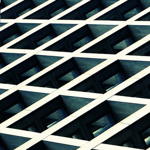
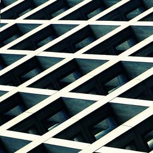

# 使用深度學習消除JPEG壓縮失真

### 圖片一
#### 請注意山的邊緣以及其他物件的邊緣
##### 原圖

##### 75%壓縮率

##### 50%壓縮率

##### 修復75%壓縮率

##### 修復50%壓縮率

##### 修復原圖

### 圖片二
#### 請注意牆壁與帽子
##### 原圖

##### 75%壓縮率

##### 50%壓縮率

##### 修復75%壓縮率

##### 修復50%壓縮率

##### 修復原圖

### 圖片三
#### 請注意亮度差較大的地方
##### 原圖

##### 75%壓縮率

##### 50%壓縮率

##### 修復75%壓縮率

##### 修復50%壓縮率

##### 修復原圖

### 想看更多圖片請看其他資料夾
